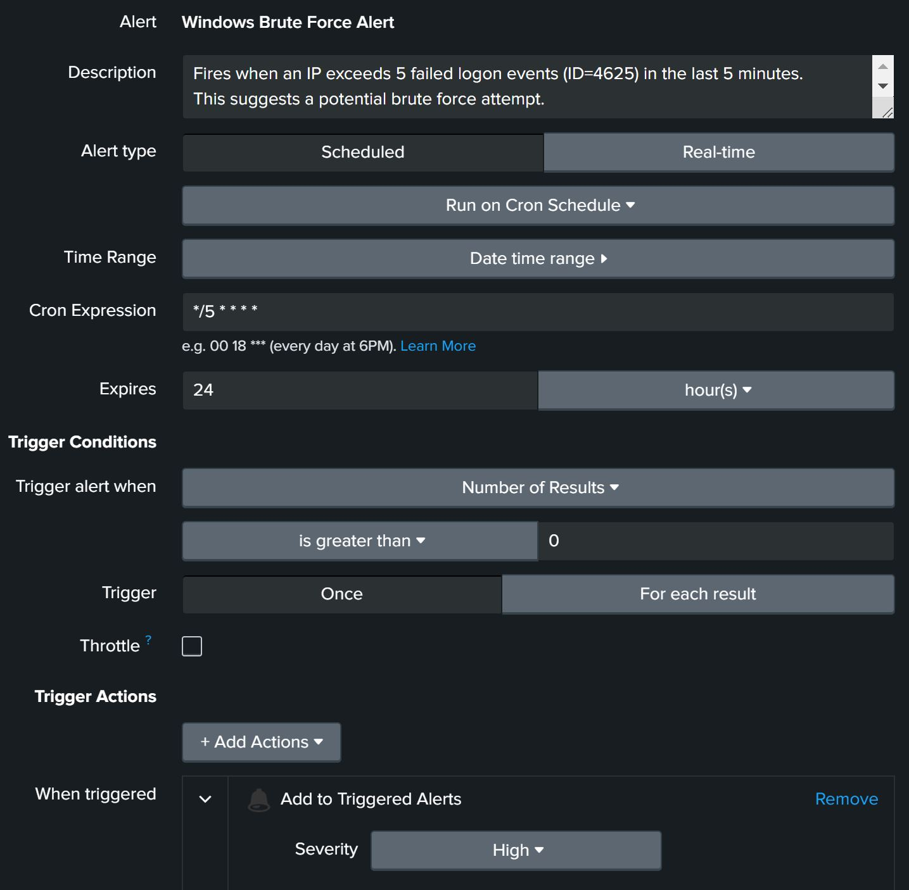

# SOC Simulator with Splunk

## Introduction
This project is a SOC (Security Operations Center) simulation,
designed to demonstrate skills in SIEM/Splunk and cybersecurity.
It generates logs with fake IPs and a malicious IP to simulate scanning and
brute force. 

**Purpose**
- Show how to generate realistic logs for training.
- Build a Splunk dashboard with multiple panels.
- Implement scheduled alerts for security scenarios.

It includes:
- A Python script that generates fake logs (Apache Access, Apache Error, Firewall, Windows).
- A Splunk dashboard showing various panels (HTTP scanning, brute force attempts, etc.).
- Several Splunk alerts triggered by abnormal behaviors.

## Table of Contents
- [Introduction](#introduction)
- [Features](#features)
- [Requirements](#requirements)
- [How to Use](#how-to-use)
   - [Sample queries for dashboard panels](#sample-queries-for-dashboard-panels)
   - [Sample queries for alerts](#sample-queries-for-alerts)
- [Screenshots](#screenshots)
- [Notes](#notes)
- [License](#license)
- [Author](#author)


## Features
- **generate_logs.py** produces:
  - `apache_access.txt`
  - `apache_error.txt`
  - `firewall_logs.txt`
  - `windows_logs.txt`
- **Splunk Dashboard** includes:
  1. HTTP Status Code Distribution
  2. HTTP Activity Over Time
  3. Top Requesting IPs
  4. Error Severity Over Time
  5. Firewall Activity
  6. Windows Event ID Distribution
  7. Suspected HTTP Scanning (404/500)
  8. Windows Brute Force Attempts (4625)
  9. Geo Distribution of Traffic
- **Alerts**:
  1. HTTP Scanning (404 Overload)
  2. High Error Rate
  3. INCIDENT_IP Scanning
  4. Windows Brute Force

## Requirements
- Python 3 to run the script `generate_logs.py`.
- A Splunk environment (Splunk Enterprise / Free) to ingest data and view the dashboards.

## How to Use

### 1) Clone this repository or download it
```bash
git clone https://github.com/claudiocirese/SOC-Simulation-Splunk.git
cd  SOC-Simulation-Splunk
```

### 2) Run the script to generate the logs
```bash
python generate_logs.py
```
This creates the following logs:
- `apache_access.txt`
- `apache_error.txt`
- `firewall_logs.txt`
- `windows_logs.txt`

### 3) Add data
1. In Splunk, go to “Add Data” → “Upload” and select `apache_access.txt`.
   - sourcetype = `apache_access`
   - index = `<your_index>`
2. Repeat for `apache_error.txt` (apache_error), `firewall_logs.txt` (firewall_log), 
`windows_logs.txt`(win_event_log).

### 4) Build the dashboard
- Create a new dashboard in Splunk (for example, "SOC_Dashboard").
- Save searches as panels. Examples include HTTP Status, HTTP Activity Over Time, and so on.
### Sample queries for dashboard panels
- **HTTP Status Code Distribution**
```spl 
index=<your_index> sourcetype=apache_access
| stats count AS Requests by status
| sort -Requests
``` 
- **HTTP Activity Over Time**
```spl 
index=<your_index> sourcetype=apache_access
| timechart count by status
```
- **Top Requesting IPs**
```spl
index=<your_index> sourcetype=apache_access
| stats count AS Hits by clientip
| sort -Hits
| head 4
```
- **Error Severity Over Time**
```spl
index=<your_index> sourcetype=apache_error
| timechart count AS Events by severity
```
- **Suspected HTTP Scanning (404/500)**
```spl
index=<your_index> sourcetype=apache_access (status=404 OR status=500)
| stats count AS ErrorHits by clientip
| sort -ErrorHits
| head 10
```
- **Windows Event ID**
```spl 
index=<your_index> sourcetype=win_event_log
| stats count AS "Events" by ID
| sort -Events
```
- **Firewall Activity**
```spl
index=<your_index> sourcetype=firewall_log
| stats count AS "Count" by act
| sort -Count
```
- **Windows Bruteforce Attempts (4625)**
```spl
index=<your_index> sourcetype=win_event_log ID=4625
| stats count AS FailCount by clientip
| sort -FailCount
| head 10
```
- **Geo Distribution of Traffic**
```spl
index=<your_index> (sourcetype=apache_access OR sourcetype=apache_error OR sourcetype=firewall_log OR sourcetype=win_event_log)
| iplocation clientip
| geostats latfield=lat longfield=lon count
```

### 5) Create Alerts
- From “Search & Reporting”, save researches as “Scheduled Alert” (see queries), for 
scenarios like brute force attempts, 404 errors, or a specific INCIDENT_IP generating
too many errors.
- Advised thresholds: > 10 404 errors, > 5 login fail...
### Sample queries for alerts
- **HTTP Scanning (404 Overload)**
```spl
index=<your_index> sourcetype=apache_access (status=404 OR status=500)
| stats count AS ErrorHits by clientip
| where ErrorHits > 10
```
- **High Error Rate**
```spl
index=<your_index> sourcetype=apache_access
| eval isError=if(status>=400,1,0)
| stats count(eval(isError=1)) AS Errors, count AS Total
| eval ErrorRate=round((Errors*100)/Total,2)
| where ErrorRate > 10
```
- **INCIDENT_IP Scanning**
```spl
index=<your_index> sourcetype=apache_access clientip=9.9.9.9 (status=404 OR status=500)
| stats count AS ErrorHits
| where ErrorHits > 20
```
- **Windows Brute Force**
```spl
index=<your_index> sourcetype=win_event_log ID=4625
| stats count AS FailCount by clientip
| where FailCount > 5
```
### Handling Alerts

Below are recommended actions when an alert triggers:

1. **HTTP Scanning (404 Overload)**  
   - Investigate the source IP for possible scanning.
   - Check if it's a known vulnerability scanner or malicious source.
   - Potentially block the IP at firewall if malicious.

2. **High Error Rate**  
   - Inspect server resources and logs for 404/500 spikes or high system load.
   - Could be an attack or a performance issue.

3. **INCIDENT_IP Scanning**  
   - If the IP 9.9.9.9 triggers too many errors, treat it as a priority threat.
   - Escalate to the security team for immediate action (block or in-depth analysis).

4. **Windows Brute Force**  
   - Check repeated failed logon attempts (ID=4625).
   - Possibly lock the account or block the IP.
   - Investigate if user credentials are compromised.

## Screenshots
The following screenshots show parts of the simulation:
- **Dashboard**  
  
  
  
- **Alerts**  
  
  
  
  

## Notes
- If you do not load more logs in the future, the dataset remains static, but is sufficient 
for demonstration.
- If you want to see alerts actually triggered, you can re-generate logs with fresh timestamps.
- You can adjust thresholds both in the Python script (distribution of errors,
incident IP) and the Splunk alerts (number of errors or failed logins).

## License
This project is released under the [MIT License](./LICENSE).

## Author
Created by Claudio Cirese, (C) 2024.  
For any inquiries, contact <claudiocirese1@gmail.com>  
[LinkedIn](https://www.linkedin.com/in/claudio-cirese-9792472bb)